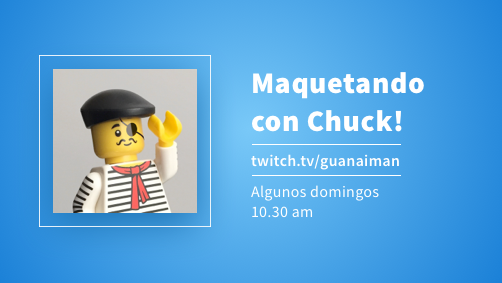

# Maquetando con Chuck!

El origen de estos vídeos es porque cuando estaba de profe en un bootcamp eché mucho en falta poder haber hecho suficiente énfasis en la importancia de la semántica a la hora de maquetar.

Luego tb pasa que hay mucho contenido de front con javascript y no tanto de maquetación y semántica.

Por eso, unos domingos cada mes, voy a estar maquetando en directo un ratico.

:)

## Sesiones
Durante unos días los vídeos seguirán en el canal de Twitch pero luego los dejaré subidos en Youtube en [esta playlist](https://www.youtube.com/playlist?list=PLO-mtrYE0827SRqJnPOOU1OQLbN_OZpT6).

1. **00 -Tooltip** | [Vídeo 1: `45 min`](https://www.youtube.com/watch?v=pwtNFzrbNAM), [vídeo 2: `casi 1h`](https://www.youtube.com/watch?v=SqGFoHnJg60)
1. **01 - HTML (y semántica)** | [Vídeo: `1h y cuarto`](https://www.youtube.com/watch?v=5vATBkG4Ijw)
1. **02 - Módulo de vídeos destacados** | [Vídeo: `casi 1h`](https://youtu.be/UTLDi4RBx0U)
1. **03 - Footer 1/2** | [Vídeo: `1h y cuarto`](https://youtu.be/5WGKZnxy4b4)
1. **04 - Footer 2/2** | [Vídeo: `Dos horacas`](https://youtu.be/tVqJOHIjB0w)
1. **05 - CSS, introducción y cómo se usa** | [Vídeo: `1h y 20`](https://www.twitch.tv/videos/1040101112)
1. **06 - CSS: Display** | [Vídeo: `Casi 1h`](https://www.twitch.tv/videos/1047563750)
1. **07 - CSS: Position** | [Vídeo: `Casi 2h`](https://www.twitch.tv/videos/1054818567)
1. **08 - CSS: Flex** | [Vídeo: `Casi 3h`](https://www.twitch.tv/videos/1061931165)
1. **09 - CSS: Grid** | [Vídeo: `Más de 3h`](https://www.twitch.tv/videos/1069129885)

---
### Temas siguientes
- Preprocesadores
- Configurar nuestro editor
  - Extensiones
  - Editorconfig
- Linter de css/scss
- Organizar nuestro proyecto
- [👍 Quieres proponer un tema o elemento?](https://github.com/oneeyedman/maquetando-con-chuck/issues/1)
