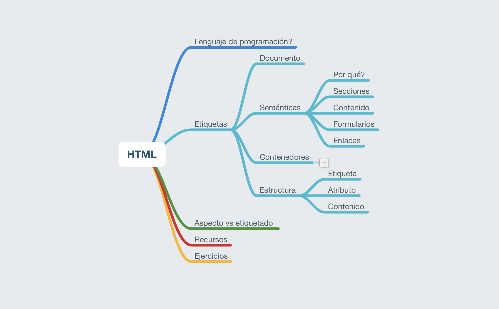

# Maquetando con Chuck 01

HTML es la base de todo lo que vemos en el navegador.
Es un sistema de etiquetas que va a dar un significado semántico a nuestro contenido.

En esta sesión vamos a ver cómo funciona, la estructura de una página, tipos de etiquetas y la importancia de la semántica.

Al final haremos un ejercicio pequeño.

Si alguien quiere practicar y le fallan los ejercicios o quiere que reviasemos algo sabéis dónde estoy: mail, dm y lo vemos.

## Etiquetas
No hay que saberse las etiquetas de memoria y en internet hay mil páginas listandolas todas. Un sitio de referencia es la MDN y aunque no es súper atractivo pues la informaicón está: https://developer.mozilla.org/es/docs/Web/HTML/Element

También hemos visto que hay un validador donde pueden enchufar tu html y te saca todas las vergüenzas: https://validator.w3.org/#validate_by_input

---

:)